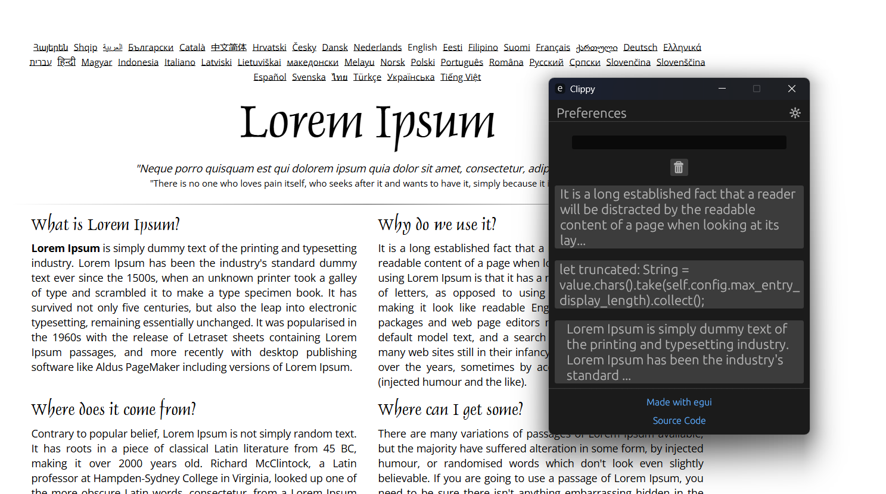

## A simple clipboard manager written in Rust

Easily manage your clipboard entries with a minimal UI.



## Installation (Linux)

_You need to have `Rust` and `Cargo` installed on your machine to run this tool. Official installation steps [here.](https://www.rust-lang.org/tools/install)_

```bash
git clone https://github.com/Rayanworkout/clippy.git

cd clippy

cargo build --release && sudo cp target/release/clippy /usr/local/bin

```

You can now call the binary from anywhere in your terminal.
