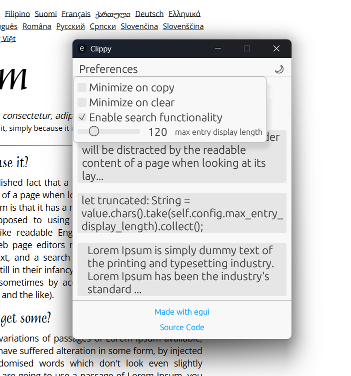

## Clippy - Clipboard Manager

**Clippy** is a powerful, cross-platform clipboard manager designed to help you easily retrieve and manage past clipboard entries. With a sleek minimal user interface and a background daemon, Clippy ensures that your clipboard history is always accessible.

Whether you're a developer, writer, or power user, Clippy simplifies your workflow by keeping track of everything you copy.


---

## Features

- **Clipboard History**: Access up to 100 previously copied items with ease.
- **Cross-Platform**: Works on Windows, macOS, and Linux.
- **Customizable Settings**:
  - Set a maximum display length for clipboard entries.
  - Minimize the UI automatically after copying or clearing.
  - Toggle between light and dark mode.
- **Daemon Support**: Runs in the background to track clipboard changes.
- **Easy Installation**: Install via Cargo or use the provided Linux install script.

---



## Installation

### Prerequisites

_You need to have `Rust` and `Cargo` installed on your machine to run this tool. Official installation steps [here.](https://www.rust-lang.org/tools/install)_

### Linux

```bash
git clone https://github.com/Rayanworkout/clippy.git

cd clippy

cargo build --release

sudo cp target/release/daemon /usr/local/bin/clippy_daemon
sudo cp target/release/ui /usr/local/bin/clippy_ui

nohup clippy_daemon &>/dev/null &
```

The application should now be running and listening for your clipboard changes.

- The history file `clipboard_history.ron` will be located in the folder from which the binary was launched.